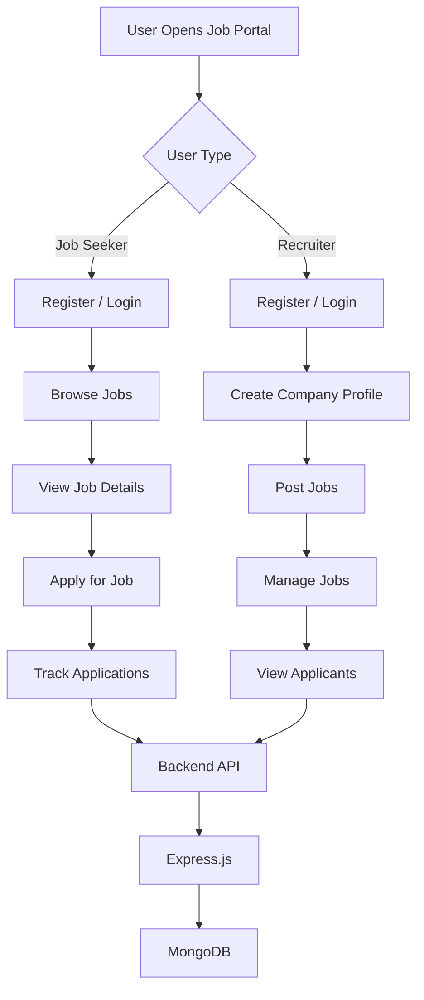
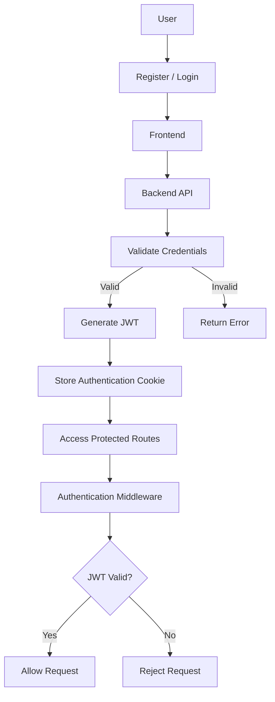

# 💼 Job Portal

A full-stack Job Portal web application built using the **MERN stack**.  
The platform allows job seekers to search and apply for jobs, while recruiters/admins can manage companies, post jobs, and manage applications.

---

## 🚀 Features

### 👨‍💻 Job Seeker

- User registration and login
- Secure authentication
- Browse available jobs
- Search for jobs
- Filter jobs by category and other criteria
- View job details
- Apply for jobs
- View applied jobs
- Manage profile
- View company information

### 🏢 Recruiter / Admin

- Secure admin/recruiter authentication
- Create and manage companies
- Set up company information
- Post new jobs
- View posted jobs
- Update and manage jobs
- View applicants
- Manage applications
- View company and job information

### 🔐 Authentication & Security

- JWT-based authentication
- Cookie-based authentication
- Protected routes
- Authentication middleware
- Role-based access control
- Secure API endpoints

### 📁 File Upload

- Multer for handling file uploads
- Cloudinary for cloud-based file/image storage

### 🔔 User Experience

- Toast notifications using Sonner
- Responsive user interface
- Reusable React components
- Animated UI using Framer Motion

---

## 🛠️ Technologies Used

### Frontend

- React.js
- Vite
- Redux Toolkit
- React Router
- Axios
- Tailwind CSS
- shadcn/ui
- Framer Motion
- Sonner

### Backend

- Node.js
- Express.js
- MongoDB
- Mongoose
- JSON Web Token (JWT)
- Cookie Parser
- Multer
- Cloudinary
- CORS

### Development Tools

- Git
- GitHub
- VS Code
- npm

---

## 📂 Project Structure

```text
Job-Portal/
│
├── backend/
│   │
│   ├── controllers/
│   │   ├── application.controller.js
│   │   ├── company.controller.js
│   │   ├── job.controller.js
│   │   └── user.controller.js
│   │
│   ├── middlewares/
│   │   ├── isAuthenticated.js
│   │   └── multer.js
│   │
│   ├── models/
│   │   ├── application.model.js
│   │   ├── company.model.js
│   │   ├── job.model.js
│   │   └── user.model.js
│   │
│   ├── routes/
│   │   ├── application.route.js
│   │   ├── company.route.js
│   │   ├── job.route.js
│   │   └── user.route.js
│   │
│   ├── utils/
│   │   ├── cloudinary.js
│   │   ├── datauri.js
│   │   └── db.js
│   │
│   ├── .env
│   ├── index.js
│   ├── package.json
│   └── package-lock.json
│
├── frontend/
│   │
│   ├── public/
│   │
│   ├── src/
│   │   │
│   │   ├── assets/
│   │   │
│   │   ├── components/
│   │   │   ├── admin/
│   │   │   ├── auth/
│   │   │   ├── shared/
│   │   │   └── ui/
│   │   │
│   │   ├── hooks/
│   │   │   ├── useGetAllAdminJobs.jsx
│   │   │   ├── useGetAllCompanies.jsx
│   │   │   ├── useGetAllJobs.jsx
│   │   │   ├── useGetAppliedJobs.jsx
│   │   │   └── useGetCompanyById.jsx
│   │   │
│   │   ├── lib/
│   │   │   └── utils.js
│   │   │
│   │   ├── redux/
│   │   │   ├── applicationSlice.js
│   │   │   ├── authSlice.js
│   │   │   ├── companySlice.js
│   │   │   ├── jobSlice.js
│   │   │   └── store.js
│   │   │
│   │   ├── utils/
│   │   │   └── constant.js
│   │   │
│   │   ├── App.jsx
│   │   ├── App.css
│   │   ├── index.css
│   │   └── main.jsx
│   │
│   ├── components.json
│   ├── eslint.config.js
│   ├── index.html
│   ├── jsconfig.json
│   ├── package.json
│   ├── package-lock.json
│   └── vite.config.js
│
├── .gitignore
└── README.md
```

⚙️ Installation
1. Clone the Repository
git clone https://github.com/Sushovanbarik/job-portal.git

2. Navigate to the Project
cd job-portal

🔧 Backend Setup
Go to the backend folder:
cd backend

Install the dependencies:
npm install

Create a .env file inside the backend folder.
Example:
PORT=8000
MONGO_URI=your_mongodb_connection_string
SECRET_KEY=your_jwt_secret_key
CLOUD_NAME=your_cloudinary_cloud_name
API_KEY=your_cloudinary_api_key
API_SECRET=your_cloudinary_api_secret

Start the backend server:
npm run dev

The backend will run on:
http://localhost:8000

🎨 Frontend Setup
Open a new terminal.
Go to the frontend folder:
cd frontend

Install dependencies:
npm install

Start the frontend:
npm run dev

The frontend will normally run on:
http://localhost:5173

🗄️ Database
This project uses MongoDB as the database.
MongoDB stores information such as:
- Users
- Companies
- Jobs
- Applications
MongoDB Atlas can be used to host the database in the cloud.

☁️ Cloudinary
Cloudinary is used for storing uploaded images/files.
The backend connects to Cloudinary using environment variables.
Do not expose your Cloudinary credentials publicly.

## 🔄 Application Workflow



## 🔐 Authentication Flow



## 📌 Main Modules

### 👤 User Module

Responsible for:

- Registration
- Login
- Logout
- Profile Management
- Authentication

### 💼 Job Module

Responsible for:

- Creating Jobs
- Viewing Jobs
- Searching Jobs
- Updating Jobs
- Managing Jobs

### 🏢 Company Module

Responsible for:

- Creating Companies
- Updating Company Information
- Viewing Companies
- Managing Company Details

### 📝 Application Module

Responsible for:

- Applying for Jobs
- Viewing Applications
- Managing Applications
- Tracking Applied Jobs


## 🧩 Frontend Components

The frontend contains reusable React components for:

- Authentication
- Navigation
- Job Browsing
- Job Descriptions
- Job Cards
- Company Information
- Application Management
- Admin Dashboard
- Forms
- Tables
- UI Components

The project also uses custom React hooks for fetching:

- Jobs
- Companies
- Applications
- Admin Data


## 🗃️ Redux State Management

Redux Toolkit is used to manage the application's global state.

### Main Redux Slices

- `applicationSlice.js` — Manages job applications
- `authSlice.js` — Manages authentication and user state
- `companySlice.js` — Manages company-related state
- `jobSlice.js` — Manages job-related state
- `store.js` — Configures the Redux store

These Redux slices manage authentication, jobs, companies, and applications throughout the application.


## 🔒 Environment Variables

Sensitive information such as:

- MongoDB connection strings
- JWT secret keys
- Cloudinary credentials
- API keys

should be stored in `.env` files.


## 🚀 Future Improvements

Some possible future improvements include:

- 🤖 AI-based Job Recommendations
- 🔔 Real-time Notifications
- 📄 Resume Parsing
- 🔎 Advanced Job Search
- 📅 Interview Scheduling
- 📊 Recruiter Analytics Dashboard
- 📧 Email Notifications
- 📬 Application Status Notifications
- ☁️ Cloud Deployment
- 📱 Improved Mobile Responsiveness


## 👨‍💻 Author

**Sushovan Barik**

- GitHub: [Sushovanbarik](https://github.com/Sushovanbarik)
